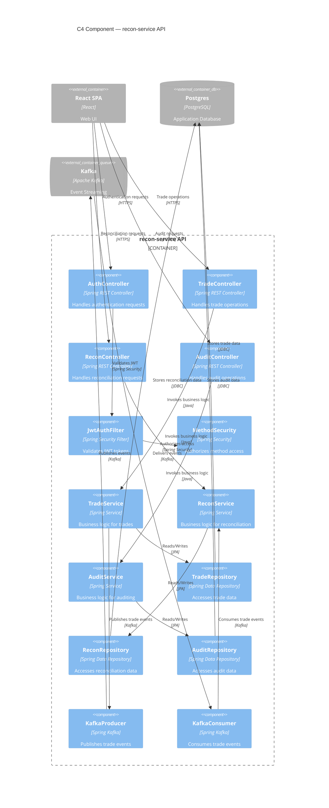

```mermaid
C4Component
title C4 Component — recon-service API

Container_Ext(ui, "React SPA", "React", "Web UI")
ContainerDb_Ext(postgres, "Postgres", "PostgreSQL", "Application Database")
ContainerQueue_Ext(kafka, "Kafka", "Apache Kafka", "Event Streaming")

Container_Boundary(api, "recon-service API") {

    Component(authController, "AuthController", "Spring REST Controller", "Handles authentication requests")
    Component(tradeController, "TradeController", "Spring REST Controller", "Handles trade operations")
    Component(reconController, "ReconController", "Spring REST Controller", "Handles reconciliation requests")
    Component(auditController, "AuditController", "Spring REST Controller", "Handles audit operations")

    Component(jwtFilter, "JwtAuthFilter", "Spring Security Filter", "Validates JWT tokens")
    Component(methodSecurity, "MethodSecurity", "Spring Security", "Authorizes method access")

    Component(tradeService, "TradeService", "Spring Service", "Business logic for trades")
    Component(reconService, "ReconService", "Spring Service", "Business logic for reconciliation")
    Component(auditService, "AuditService", "Spring Service", "Business logic for auditing")

    Component(tradeRepository, "TradeRepository", "Spring Data Repository", "Accesses trade data")
    Component(reconRepository, "ReconRepository", "Spring Data Repository", "Accesses reconciliation data")
    Component(auditRepository, "AuditRepository", "Spring Data Repository", "Accesses audit data")

    Component(kafkaProducer, "KafkaProducer", "Spring Kafka", "Publishes trade events")
    Component(kafkaConsumer, "KafkaConsumer", "Spring Kafka", "Consumes trade events")
}

Rel(ui, authController, "Authentication requests", "HTTPS")
Rel(ui, tradeController, "Trade operations", "HTTPS")
Rel(ui, reconController, "Reconciliation requests", "HTTPS")
Rel(ui, auditController, "Audit requests", "HTTPS")

Rel(authController, jwtFilter, "Validates JWT", "Spring Security")
Rel(jwtFilter, methodSecurity, "Authorizes access", "Spring Security")

Rel(tradeController, tradeService, "Invokes business logic", "Java")
Rel(reconController, reconService, "Invokes business logic", "Java")
Rel(auditController, auditService, "Invokes business logic", "Java")

Rel(tradeService, tradeRepository, "Reads/Writes", "JPA")
Rel(reconService, reconRepository, "Reads/Writes", "JPA")
Rel(auditService, auditRepository, "Reads/Writes", "JPA")

Rel(tradeRepository, postgres, "Stores trade data", "JDBC")
Rel(reconRepository, postgres, "Stores reconciliation data", "JDBC")
Rel(auditRepository, postgres, "Stores audit data", "JDBC")

Rel(tradeService, kafkaProducer, "Publishes trade events", "Kafka")
Rel(kafkaConsumer, reconService, "Consumes trade events", "Kafka")
Rel(kafkaProducer, kafka, "Publishes events", "Kafka")
Rel(kafka, kafkaConsumer, "Delivers events", "Kafka")
```