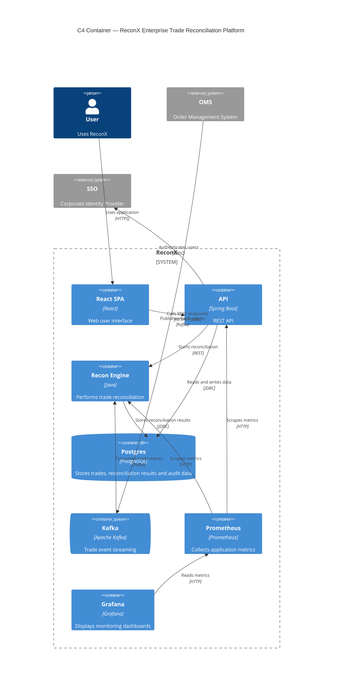

```mermaid
C4Container
title C4 Container — ReconX Enterprise Trade Reconciliation Platform

Person(user, "User", "Uses ReconX")
System_Ext(oms, "OMS", "Order Management System")
System_Ext(sso, "SSO", "Corporate Identity Provider")

System_Boundary(reconxBoundary, "ReconX") {

    Container(spa, "React SPA", "React", "Web user interface")

    Container(api, "API", "Spring Boot", "REST API")

    Container(engine, "Recon Engine", "Java", "Performs trade reconciliation")

    ContainerDb(postgres, "Postgres", "PostgreSQL", "Stores trades, reconciliation results and audit data")

    ContainerQueue(kafka, "Kafka", "Apache Kafka", "Trade event streaming")

    Container(prometheus, "Prometheus", "Prometheus", "Collects application metrics")

    Container(grafana, "Grafana", "Grafana", "Displays monitoring dashboards")
}

Rel(user, spa, "Uses application", "HTTPS")

Rel(spa, api, "Calls REST endpoints", "HTTPS / JSON")

Rel(api, engine, "Starts reconciliation", "REST")

Rel(api, postgres, "Reads and writes data", "JDBC")

Rel(engine, postgres, "Stores reconciliation results", "JDBC")

Rel(oms, kafka, "Publishes trade events", "Kafka")

Rel(kafka, engine, "Consumes trade events", "Kafka")

Rel(api, sso, "Authenticates users", "OIDC")

Rel(prometheus, api, "Scrapes metrics", "HTTP")

Rel(prometheus, engine, "Scrapes metrics", "HTTP")

Rel(grafana, prometheus, "Reads metrics", "HTTP")
```