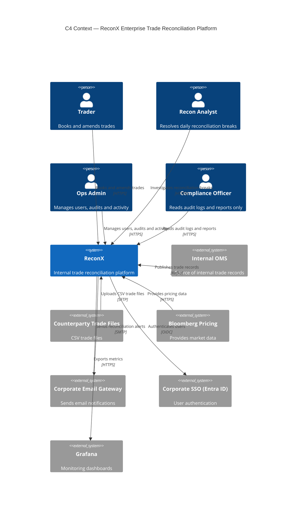

```mermaid
C4Context
title C4 Context — ReconX Enterprise Trade Reconciliation Platform

Person(trader, "Trader", "Books and amends trades")
Person(analyst, "Recon Analyst", "Resolves daily reconciliation breaks")
Person(ops, "Ops Admin", "Manages users, audits and activity")
Person(compliance, "Compliance Officer", "Reads audit logs and reports only")

System(reconx, "ReconX", "Internal trade reconciliation platform")

System_Ext(oms, "Internal OMS", "Source of internal trade records")
System_Ext(sftp, "Counterparty Trade Files", "CSV trade files")
System_Ext(bloomberg, "Bloomberg Pricing", "Provides market data")
System_Ext(email, "Corporate Email Gateway", "Sends email notifications")
System_Ext(sso, "Corporate SSO (Entra ID)", "User authentication")
System_Ext(grafana, "Grafana", "Monitoring dashboards")

Rel(trader, reconx, "Books and amends trades", "HTTPS")
Rel(analyst, reconx, "Investigates reconciliation breaks", "HTTPS")
Rel(ops, reconx, "Manages users, audits and activity", "HTTPS")
Rel(compliance, reconx, "Reads audit logs and reports", "HTTPS")

Rel(oms, reconx, "Publishes trade records", "Kafka")
Rel(sftp, reconx, "Uploads CSV trade files", "SFTP")
Rel(bloomberg, reconx, "Provides pricing data", "HTTPS")
Rel(reconx, email, "Sends reconciliation alerts", "SMTP")
Rel(reconx, sso, "Authenticates users", "OIDC")
Rel(reconx, grafana, "Exports metrics", "HTTPS")
```